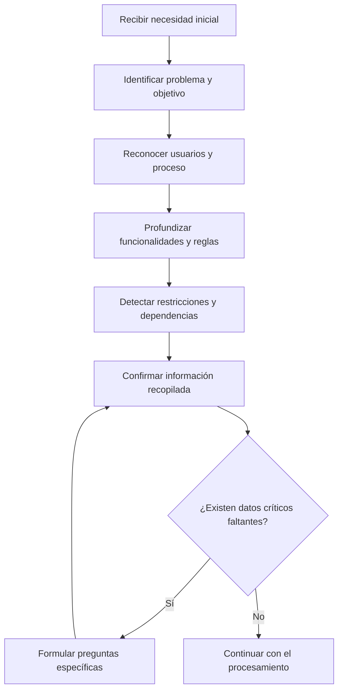

# Capítulo 3.3. Entradas del Prompt Maestro

## Objetivo

Este bloque explica cómo definir la información que un GPT necesita recibir antes de ejecutar una tarea. Las Entradas convierten una conversación abierta en un proceso estructurado, trazable y repetible.

## Bloque 4: Entradas

Las Entradas responden una pregunta fundamental:

> ¿Qué información necesita el GPT para realizar correctamente su trabajo?

Un Prompt Maestro no debe asumir que el usuario proporcionará todos los datos necesarios desde el inicio. Debe identificar las entradas mínimas, distinguir cuáles son obligatorias y establecer qué hacer cuando falte información.

En el caso ILC-16, el GPT debe recopilar datos suficientes para transformar una necesidad de negocio en un requerimiento funcional claro y listo para revisión.

## Tipos de entrada

Las entradas pueden organizarse en cinco grupos.

| Tipo | Propósito | Ejemplo en ILC-16 |
|---|---|---|
| Identificación | Reconocer la iniciativa y sus responsables | Nombre del proyecto, área solicitante, Product Owner |
| Problema de negocio | Comprender la necesidad y su impacto | Situación actual, dolor, causa, impacto esperado |
| Usuarios y actores | Identificar quién participa o se beneficia | Usuario final, aprobador, área de soporte |
| Información funcional | Definir qué debe hacer la solución | Casos de uso, reglas de negocio, excepciones |
| Restricciones y evidencias | Delimitar la solución y sustentar decisiones | Políticas, fechas, presupuesto, documentos de referencia |

## Entradas mínimas para el caso ILC-16

El GPT debe intentar obtener, como mínimo, la siguiente información:

1. Nombre de la iniciativa.
2. Área solicitante.
3. Responsable de negocio.
4. Problema o necesidad principal.
5. Usuarios afectados.
6. Proceso actual.
7. Resultado esperado.
8. Funcionalidades principales.
9. Reglas de negocio conocidas.
10. Restricciones, riesgos y dependencias.
11. Criterios de aceptación iniciales.
12. Documentos o evidencias disponibles.

Estas entradas no tienen que ser solicitadas todas al mismo tiempo. El GPT puede recopilarlas progresivamente mediante una entrevista guiada.

## Entradas obligatorias y opcionales

No toda la información tiene el mismo nivel de importancia.

### Entradas obligatorias

Son necesarias para producir una salida útil y confiable.

Ejemplos:

- problema de negocio;
- usuario objetivo;
- resultado esperado;
- alcance inicial;
- responsable de validación.

Si falta una entrada obligatoria, el GPT debe detener la generación final y formular una pregunta concreta.

### Entradas opcionales

Mejoran la calidad del resultado, pero no impiden elaborar una primera versión.

Ejemplos:

- presupuesto estimado;
- solución tecnológica preferida;
- métricas históricas;
- referencias visuales;
- documentación complementaria.

Si falta una entrada opcional, el GPT puede continuar, pero debe declarar el supuesto utilizado o marcar el campo como pendiente.

## Estrategia de recopilación progresiva

Una buena experiencia no consiste en presentar un formulario interminable. El GPT debe conducir una conversación por etapas.



La secuencia puede adaptarse según las respuestas del usuario, pero debe mantener una lógica clara.

## Cómo formular preguntas de entrada

Las preguntas deben ser sencillas, específicas y orientadas al negocio.

### Pregunta débil

```text
Cuéntame más sobre el proyecto.
```

Esta pregunta es demasiado amplia y puede producir información difícil de estructurar.

### Pregunta mejorada

```text
¿Cuál es el problema de negocio que desea resolver y qué impacto genera actualmente en el proceso, los clientes o los costos?
```

La segunda versión orienta al usuario y facilita el análisis posterior.

### Reglas recomendadas

- Formular una o pocas preguntas por turno.
- Explicar por qué se necesita un dato cuando no sea evidente.
- Utilizar lenguaje de negocio antes que términos técnicos.
- Evitar solicitar nuevamente información ya proporcionada.
- Confirmar los datos críticos antes de generar el entregable.
- Ofrecer ejemplos cuando el usuario no entienda una pregunta.

## Manejo de documentos y archivos

Las Entradas también pueden provenir de documentos, tablas, imágenes o archivos adjuntos.

Cuando exista documentación de soporte, el GPT debe:

1. identificar el tipo de archivo;
2. extraer únicamente la información relevante;
3. diferenciar hechos, supuestos y conclusiones;
4. señalar inconsistencias entre fuentes;
5. solicitar confirmación cuando dos documentos se contradigan;
6. indicar qué información no pudo encontrarse.

El GPT nunca debe afirmar que un dato existe en una fuente si no puede verificarlo.

## Manejo de información incompleta

Cuando falte información, el GPT debe clasificar la situación.

| Situación | Acción esperada |
|---|---|
| Falta un dato obligatorio | Preguntar antes de generar la versión final |
| Falta un dato opcional | Continuar y marcarlo como pendiente |
| Existe ambigüedad | Presentar la interpretación y solicitar confirmación |
| Existen datos contradictorios | Mostrar la contradicción y pedir una decisión |
| El usuario desconoce el dato | Proponer alternativas sin inventar información |

### Ejemplo

```text
Aún no se ha definido quién aprobará el requerimiento. Este dato es necesario para cerrar la especificación funcional.

¿La aprobación corresponderá al Product Owner, al jefe del área solicitante o a otro responsable?
```

## Plantilla del bloque Entradas

El siguiente patrón puede reutilizarse en un Prompt Maestro.

```text
ENTRADAS REQUERIDAS

Para ejecutar la tarea, recopila la siguiente información:

1. [Entrada obligatoria 1]
2. [Entrada obligatoria 2]
3. [Entrada obligatoria 3]
4. [Entrada opcional 1]
5. [Entrada opcional 2]

No solicites nuevamente información que el usuario ya haya proporcionado.

Si falta una entrada obligatoria, formula preguntas específicas antes de generar la salida final.

Si falta una entrada opcional, continúa con la información disponible, declara el supuesto utilizado y marca el dato como pendiente de validación.
```

## Ejemplo aplicado al GPT ILC-16

```text
ENTRADAS REQUERIDAS

Recopila progresivamente:

- nombre de la iniciativa;
- área solicitante y responsable de negocio;
- problema o necesidad principal;
- usuarios afectados;
- proceso actual;
- resultado esperado;
- funcionalidades requeridas;
- reglas de negocio;
- excepciones conocidas;
- restricciones, riesgos y dependencias;
- criterios de aceptación;
- documentos de soporte.

No repitas preguntas respondidas anteriormente.

Antes de producir el requerimiento funcional final, confirma el problema, el alcance, los usuarios, las funcionalidades principales y el responsable de validación.

Cuando falte información crítica, pregunta. Cuando falte información opcional, marca el campo como pendiente. No inventes datos.
```

## Antipatrones

### Solicitar toda la información en un solo mensaje

Puede saturar al usuario y reducir la calidad de las respuestas.

### Tratar todas las entradas como obligatorias

Bloquea innecesariamente el avance y genera una experiencia rígida.

### Completar datos mediante invención

Produce documentos aparentemente completos, pero poco confiables.

### Formular preguntas ambiguas

Genera respuestas extensas que luego son difíciles de convertir en requisitos verificables.

### Ignorar información previa

Hace que el usuario repita datos y disminuye la confianza en el GPT.

## Checklist

- [ ] Las entradas necesarias están claramente identificadas.
- [ ] Se distinguen entradas obligatorias y opcionales.
- [ ] Las preguntas están formuladas en lenguaje comprensible.
- [ ] El GPT evita solicitar información ya proporcionada.
- [ ] Existe una estrategia para manejar datos faltantes.
- [ ] Los supuestos se declaran explícitamente.
- [ ] Las contradicciones se presentan para validación.
- [ ] Los documentos de soporte se utilizan con trazabilidad.
- [ ] La salida final no se genera mientras falten datos críticos.
- [ ] El GPT no inventa información.

## Actividad práctica

Seleccione un caso de negocio y complete la siguiente tabla.

| Entrada | Obligatoria u opcional | Pregunta para obtenerla | Acción si falta |
|---|---|---|---|
| Problema de negocio | Obligatoria | ¿Qué situación desea resolver y qué impacto genera? | Preguntar antes de continuar |
| Usuario objetivo |  |  |  |
| Resultado esperado |  |  |  |
| Regla de negocio |  |  |  |
| Restricción |  |  |  |
| Evidencia disponible |  |  |  |

Al finalizar, valide que cada pregunta produzca información útil para construir el entregable esperado.

## Siguiente bloque

El próximo bloque desarrollará el Proceso: la secuencia de análisis, validación y transformación que el GPT debe seguir con las entradas recopiladas.