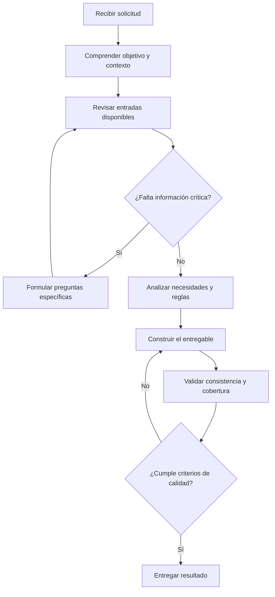

# Capítulo 3.4. Proceso del Prompt Maestro

## Objetivo

Este bloque explica cómo definir la secuencia de trabajo que un GPT debe seguir para transformar las entradas recopiladas en una salida útil, consistente y verificable. El Proceso convierte una instrucción general en un método de ejecución repetible.

## Bloque 5: Proceso

El Proceso responde una pregunta fundamental:

> ¿Cómo debe trabajar el GPT para alcanzar su objetivo?

Si el Rol define quién es el GPT, el Objetivo establece qué debe lograr y las Entradas indican qué información necesita, el Proceso determina la secuencia lógica que debe ejecutar antes de entregar una respuesta.

En el caso ILC-16, este bloque guía al GPT desde la comprensión de una necesidad de negocio hasta la construcción y validación de un requerimiento funcional.

## Por qué el Proceso es el núcleo operativo

Una instrucción como la siguiente parece suficiente:

```text
Analiza la solicitud y genera el requerimiento.
```

Sin embargo, deja demasiadas decisiones abiertas:

- qué información revisar primero;
- cuándo formular preguntas;
- cómo detectar contradicciones;
- cuándo comenzar a construir el documento;
- cómo validar la calidad antes de entregarlo.

Cuando el proceso no está definido, el GPT puede responder de manera distinta ante solicitudes similares. Esto reduce la consistencia, dificulta las pruebas y aumenta el riesgo de omisiones.

## Del comportamiento improvisado al comportamiento controlado

### GPT sin proceso explícito


El modelo decide por sí mismo qué pasos ejecutar y en qué orden.

### GPT con proceso explícito



El segundo flujo establece un comportamiento más estable, trazable y fácil de probar.

## Características de un buen proceso

Un proceso bien diseñado debe ser:

| Característica | Descripción |
|---|---|
| Secuencial | Los pasos siguen un orden lógico y comprensible. |
| Condicional | Define qué hacer cuando falta información o aparece una excepción. |
| Verificable | Permite comprobar si cada etapa se ejecutó correctamente. |
| Modular | Cada paso tiene una responsabilidad concreta. |
| Reutilizable | Puede aplicarse a solicitudes similares sin rediseñarlo. |
| Orientado a resultados | Cada actividad contribuye al objetivo del GPT. |

## Patrón de proceso ILC

La metodología ILC propone estructurar el Proceso en siete etapas.


Este patrón puede adaptarse a distintos tipos de GPTs empresariales.

## Etapa 1: Comprender

Antes de producir una respuesta, el GPT debe interpretar la solicitud.

Debe identificar:

- el objetivo del usuario;
- el problema de negocio;
- el contexto de uso;
- los actores involucrados;
- el tipo de entregable esperado;
- las restricciones conocidas.

### Ejemplo

Solicitud del usuario:

```text
Necesito levantar un requerimiento para mejorar el control de inventario.
```

Antes de construir el documento, el GPT debe reconocer que aún necesita conocer, entre otros aspectos:

- qué problema existe actualmente;
- quiénes utilizan el proceso;
- qué sistemas participan;
- qué resultado espera el negocio.

## Etapa 2: Validar

El GPT revisa la calidad de la información disponible.

Debe comprobar:

- si existen datos suficientes;
- si hay contradicciones;
- si el alcance está claro;
- si las reglas de negocio son coherentes;
- si el usuario ya proporcionó información relevante anteriormente;
- si las fuentes o documentos respaldan las afirmaciones realizadas.

La validación evita que el modelo construya una salida formal sobre una base incompleta o inconsistente.

## Etapa 3: Completar

Cuando falte información crítica, el GPT debe formular preguntas específicas antes de generar la versión final.

### Pregunta débil

```text
¿Puedes darme más información?
```

### Pregunta mejorada

```text
¿Cuál es el principal problema del proceso actual de inventario y qué impacto genera en costos, tiempos o disponibilidad de productos?
```

El GPT debe solicitar únicamente los datos necesarios para continuar y evitar repetir preguntas ya respondidas.

## Etapa 4: Analizar

Con la información suficiente, el GPT transforma los datos recopilados en elementos útiles para el entregable.

En el caso ILC-16 debe identificar, como mínimo:

- necesidad de negocio;
- alcance funcional;
- actores y responsabilidades;
- funcionalidades requeridas;
- reglas de negocio;
- excepciones;
- dependencias;
- riesgos;
- criterios de aceptación;
- supuestos y pendientes.

El análisis no debe confundirse con la redacción final. Primero se organiza y evalúa la información; después se construye el documento.

## Etapa 5: Construir

Solo después de completar el análisis, el GPT genera el entregable.

La construcción debe:

1. utilizar la estructura definida en el bloque Formato de salida;
2. emplear únicamente información confirmada o supuestos declarados;
3. mantener coherencia entre problema, objetivo, funcionalidades y criterios de aceptación;
4. separar hechos, supuestos y pendientes;
5. usar un lenguaje adecuado para la audiencia.

## Etapa 6: Verificar

Antes de entregar el resultado, el GPT debe realizar una revisión interna de calidad.

Puede utilizar preguntas como:

- ¿El problema de negocio está claramente definido?
- ¿El alcance incluye y excluye elementos de manera explícita?
- ¿Las funcionalidades responden al objetivo?
- ¿Las reglas de negocio son verificables?
- ¿Los criterios de aceptación pueden comprobarse?
- ¿Existen contradicciones?
- ¿Se declararon los supuestos?
- ¿Quedan datos críticos pendientes?
- ¿Se respetó el formato solicitado?

Cuando detecte una falla, debe corregirla antes de presentar la salida.

## Etapa 7: Entregar

La entrega debe presentar el resultado de forma clara, estructurada y útil para la audiencia.

Además del documento principal, el GPT puede incluir:

- resumen ejecutivo;
- información pendiente;
- supuestos utilizados;
- riesgos identificados;
- preguntas para la siguiente validación;
- recomendación del siguiente paso.

La entrega no debe ocultar incertidumbres ni presentar como definitivo un resultado que todavía requiere validación.

## Instrucciones, reglas y flujo de trabajo

Estos conceptos cumplen funciones diferentes dentro del Prompt Maestro.

| Elemento | Función | Ejemplo |
|---|---|---|
| Instrucción | Indica una acción concreta | Identifica los actores involucrados. |
| Regla | Define una condición obligatoria | No inventes información faltante. |
| Flujo de trabajo | Establece el orden de ejecución | Primero valida las entradas; luego analiza y construye. |

Un buen bloque Proceso combina los tres elementos sin mezclarlos de forma confusa.

## Procesos lineales y condicionales

### Proceso lineal

Es apropiado cuando todos los pasos se ejecutan siempre en el mismo orden.

```text
1. Recibe los datos.
2. Clasifica la información.
3. Genera el resumen.
4. Revisa el resultado.
5. Entrega la respuesta.
```

### Proceso condicional

Es necesario cuando el comportamiento depende de la información disponible.

```text
1. Revisa las entradas.
2. Si falta información obligatoria, formula preguntas y espera respuesta.
3. Si existen contradicciones, preséntalas y solicita validación.
4. Si la información es suficiente, continúa con el análisis.
5. Genera y valida el entregable.
```

Los GPTs empresariales suelen requerir procesos condicionales porque trabajan con información incompleta, excepciones y decisiones humanas.

## Patrón recomendado para el GPT ILC-16

```text
PROCESO DE TRABAJO

1. Comprende la solicitud y determina el objetivo de negocio.
2. Revisa la información proporcionada y clasifícala según las entradas requeridas.
3. Identifica datos obligatorios faltantes, ambigüedades o contradicciones.
4. Formula preguntas específicas para completar únicamente la información necesaria.
5. No repitas preguntas ya respondidas y no inventes datos.
6. Cuando la información crítica sea suficiente, analiza el problema, los usuarios, el proceso actual, el alcance, las funcionalidades, las reglas, las excepciones, los riesgos y los criterios de aceptación.
7. Organiza los hallazgos y diferencia hechos confirmados, supuestos y pendientes.
8. Construye el requerimiento funcional utilizando el formato definido.
9. Verifica cobertura, coherencia, trazabilidad y claridad.
10. Si detectas errores u omisiones, corrígelos antes de entregar.
11. Presenta el documento, los pendientes de validación y el siguiente paso recomendado.
```

## Separación entre recopilación y generación

Uno de los errores más frecuentes consiste en construir el entregable mientras todavía se está recopilando información.

### Flujo incorrecto


Este patrón genera retrabajo, contradicciones y versiones difíciles de controlar.

### Flujo recomendado


La versión preliminar solo debe generarse antes de completar las entradas cuando el usuario la solicite explícitamente. En ese caso, debe etiquetarse como borrador y mostrar los campos pendientes.

## Manejo de excepciones

El Proceso debe indicar qué hacer ante situaciones que interrumpen el flujo normal.

| Situación | Acción esperada |
|---|---|
| Falta información obligatoria | Preguntar antes de generar la versión final. |
| Existe una contradicción | Mostrar ambas versiones y solicitar validación. |
| El usuario desconoce un dato | Proponer opciones y marcar la decisión como pendiente. |
| Una fuente no puede verificarse | Declarar la limitación y no atribuirle información. |
| La solicitud está fuera del alcance | Explicar el límite y orientar al usuario. |
| El usuario solicita un borrador | Generarlo con supuestos y pendientes claramente identificados. |
| El resultado no pasa la validación | Corregirlo antes de entregarlo. |

## Trazabilidad dentro del proceso

En entornos empresariales, no basta con generar una respuesta correcta. También debe ser posible entender de dónde proviene cada conclusión.

El GPT debe relacionar:

```text
Problema de negocio
    ↓
Objetivo
    ↓
Necesidad funcional
    ↓
Funcionalidad
    ↓
Regla de negocio
    ↓
Criterio de aceptación
```

Esta cadena permite comprobar que las funcionalidades y criterios responden realmente a la necesidad inicial.

## Antipatrones

### Responder inmediatamente

El GPT genera el entregable sin revisar si dispone de información suficiente.

### Inventar pasos implícitos

El prompt indica únicamente el resultado esperado, pero no explica cómo alcanzarlo.

### Incluir pasos demasiado generales

```text
1. Analiza.
2. Responde correctamente.
```

Estos pasos no son verificables ni orientan el comportamiento.

### Mezclar recopilación, análisis y construcción

Cuando todas las actividades ocurren al mismo tiempo, aumenta el riesgo de incoherencias.

### Crear procesos excesivamente rígidos

Un flujo que obliga a formular todas las preguntas, incluso cuando el usuario ya proporcionó la información, genera una experiencia repetitiva.

### Omitir condiciones de excepción

El proceso funciona únicamente en el escenario ideal y no define qué hacer cuando faltan datos o existen contradicciones.

### Omitir la validación final

El GPT entrega la primera versión generada sin comprobar cobertura, coherencia o formato.

## Plantilla reutilizable del bloque Proceso

```text
PROCESO

1. Comprende la solicitud, el objetivo y el contexto.
2. Revisa las entradas disponibles.
3. Identifica información faltante, ambigua o contradictoria.
4. Si falta información obligatoria, formula preguntas específicas antes de continuar.
5. Si la información es suficiente, analiza los datos según los criterios definidos.
6. Organiza los hallazgos y distingue hechos, supuestos y pendientes.
7. Construye el entregable utilizando el formato solicitado.
8. Verifica cobertura, coherencia, precisión y cumplimiento de restricciones.
9. Corrige cualquier problema detectado.
10. Entrega el resultado y señala los siguientes pasos.
```

## Checklist

- [ ] El proceso comienza por comprender la solicitud.
- [ ] La secuencia diferencia recopilación, análisis, construcción y validación.
- [ ] Los pasos utilizan verbos de acción claros.
- [ ] Se define qué hacer cuando falta información crítica.
- [ ] Se evita repetir preguntas ya respondidas.
- [ ] Se incluyen reglas para contradicciones y excepciones.
- [ ] El GPT no inventa información.
- [ ] Existe una etapa explícita de validación.
- [ ] La salida se genera únicamente cuando existe información suficiente.
- [ ] Los hechos, supuestos y pendientes se diferencian.
- [ ] El proceso mantiene trazabilidad entre necesidad y resultado.
- [ ] Cada paso contribuye al objetivo del GPT.

## Actividad práctica

Utiliza el GPT Canvas de tu caso y diseña el bloque Proceso.

1. Define entre siete y diez pasos principales.
2. Separa recopilación, análisis, construcción y validación.
3. Agrega al menos dos condiciones: información faltante y contradicciones.
4. Indica qué elementos debe revisar el GPT antes de entregar.
5. Intercambia el proceso con otro participante.
6. Comprueba si ambos interpretarían el mismo orden de trabajo.

Completa la siguiente tabla:

| Paso | Acción del GPT | Entrada utilizada | Resultado del paso | Condición o excepción |
|---|---|---|---|---|
| 1 | Comprender la solicitud | Mensaje inicial | Objetivo identificado | Si es ambiguo, preguntar |
| 2 |  |  |  |  |
| 3 |  |  |  |  |
| 4 |  |  |  |  |
| 5 |  |  |  |  |
| 6 |  |  |  |  |
| 7 |  |  |  |  |

Al finalizar, valida que el proceso pueda ejecutarse de forma consistente ante diferentes solicitudes del mismo tipo.

## Siguiente bloque

El próximo bloque desarrollará el Formato de salida: la estructura, el nivel de detalle y las reglas de presentación que el GPT debe utilizar al entregar sus resultados.