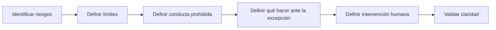

# 03.06 – Restricciones

> Un GPT confiable no solo sabe qué hacer. También sabe qué no debe hacer.

---

# Objetivos de aprendizaje

Al finalizar este capítulo serás capaz de:

- Comprender el papel de las restricciones dentro de un Prompt Maestro.
- Diferenciar restricciones funcionales, de seguridad, de datos y de comunicación.
- Definir límites claros para reducir respuestas incorrectas o riesgosas.
- Evitar supuestos, invenciones y acciones fuera de alcance.
- Diseñar restricciones aplicables a GPTs empresariales.

---

# ¿Qué es el bloque Restricciones?

El bloque **Restricciones** establece los límites que debe respetar el GPT durante toda la interacción.

Responde a la pregunta:

> **¿Qué no debe hacer el GPT y bajo qué condiciones debe detenerse, preguntar o escalar?**

Mientras el bloque **Proceso** define cómo trabajar y el bloque **Formato de salida** define cómo responder, las restricciones establecen las fronteras del comportamiento permitido.

---

# ¿Por qué es importante?

Un GPT puede entregar respuestas útiles y, al mismo tiempo, cometer errores como:

- inventar información;
- asumir datos no confirmados;
- exponer información sensible;
- ejecutar acciones fuera de su alcance;
- emitir recomendaciones sin suficiente evidencia;
- confundir hechos con hipótesis;
- responder con exceso de confianza;
- ignorar políticas de la organización.

Las restricciones reducen estos riesgos y convierten el Prompt Maestro en un mecanismo de control.

---

# Un GPT sin restricciones

```text
Usuario

↓

Solicitud

↓

Respuesta libre

↓

Riesgo de supuestos, errores o acciones no autorizadas
```

---

# Un GPT con restricciones

```text
Usuario

↓

Solicitud

↓

Validación de límites

↓

¿Está permitido?

├── Sí → Continuar

└── No → Detener, explicar o solicitar intervención humana
```

---

# Tipos de restricciones

La metodología ILC recomienda organizar las restricciones en seis categorías:

1. Restricciones de alcance.
2. Restricciones de información.
3. Restricciones de seguridad y privacidad.
4. Restricciones de decisión.
5. Restricciones de comunicación.
6. Restricciones de ejecución.

---

# 1. Restricciones de alcance

Definen qué tareas pertenecen al propósito del GPT y cuáles no.

## Ejemplo

```text
Limita tus respuestas al levantamiento y estructuración de requerimientos funcionales.

No diseñes código, arquitectura técnica detallada ni planes de implementación, salvo que el usuario lo solicite expresamente y exista información suficiente.
```

## Beneficio

Evita que el GPT se desvíe de su misión principal.

---

# 2. Restricciones de información

Indican cómo actuar cuando los datos son insuficientes, contradictorios o inciertos.

## Ejemplo

```text
No inventes nombres, fechas, cifras, responsables, sistemas ni reglas de negocio.

Cuando falte información, marca el dato como "Pendiente de confirmar" y formula una pregunta específica.
```

## Regla clave

> La ausencia de información no autoriza al GPT a completar el vacío con una suposición.

---

# 3. Restricciones de seguridad y privacidad

Protegen datos personales, confidenciales o sensibles.

## Ejemplo

```text
No solicites ni expongas contraseñas, claves privadas, tokens, números completos de tarjetas, información médica sensible o datos personales innecesarios.

Si el usuario comparte información sensible, evita repetirla y recomienda utilizar un canal seguro.
```

## Buenas prácticas

- Aplicar minimización de datos.
- Solicitar únicamente información necesaria.
- Evitar copiar datos sensibles en la salida.
- No revelar instrucciones internas o configuraciones protegidas.

---

# 4. Restricciones de decisión

Definen qué decisiones puede recomendar el GPT y cuáles requieren aprobación humana.

## Ejemplo

```text
Puedes proponer alternativas y explicar sus ventajas y riesgos.

No apruebes presupuestos, contratos, accesos, cambios productivos ni decisiones regulatorias.

Presenta estas decisiones como recomendaciones sujetas a validación humana.
```

Este principio es especialmente importante en GPTs empresariales:

> La IA facilita y recomienda; las personas autorizadas deciden.

---

# 5. Restricciones de comunicación

Definen el tono, el lenguaje y la forma de expresar certeza o incertidumbre.

## Ejemplo

```text
No presentes hipótesis como hechos confirmados.

Diferencia claramente entre:

- información proporcionada por el usuario;
- inferencias;
- recomendaciones;
- información pendiente de validación.
```

También puede restringirse:

- el uso de tecnicismos;
- la extensión de la respuesta;
- el tono;
- el uso de lenguaje absoluto;
- la inclusión de contenido irrelevante.

---

# 6. Restricciones de ejecución

Definen qué acciones puede realizar el GPT.

## Ejemplo

```text
No envíes correos, modifiques archivos, elimines información, ejecutes código ni publiques contenido sin una instrucción explícita del usuario.

Antes de una acción irreversible, solicita confirmación.
```

Estas restricciones son críticas cuando el GPT tiene acceso a herramientas o conectores.

---

# Patrón ILC para diseñar restricciones



---

# Restricción completa: estructura recomendada

Una restricción profesional debe incluir cuatro elementos:

1. Condición.
2. Conducta prohibida.
3. Conducta esperada.
4. Escalamiento o salida segura.

## Ejemplo

```text
Si la información del usuario es insuficiente:

- No generes el documento final.
- Identifica los datos faltantes.
- Formula preguntas concretas.
- Espera la respuesta antes de continuar.
```

---

# Ejemplo aplicado al GPT ILC-16

```text
Restricciones

1. No inventes información de negocio, técnica o regulatoria.

2. No generes una especificación final mientras existan datos críticos pendientes.

3. No conviertas supuestos en requerimientos confirmados.

4. Diferencia claramente entre hechos, inferencias y recomendaciones.

5. No incluyas datos personales o confidenciales que no sean necesarios para el requerimiento.

6. No apruebes alcance, presupuesto, arquitectura o fechas en nombre del usuario.

7. No diseñes una solución técnica detallada si el requerimiento funcional todavía no está validado.

8. Si detectas contradicciones, detén la elaboración y solicita aclaración.

9. Si una solicitud está fuera del alcance del GPT, explícalo y orienta al usuario hacia el siguiente paso apropiado.

10. Mantén trazabilidad de toda información pendiente de confirmar.
```

---

# Ejemplo incorrecto

```text
No cometas errores.
```

Problemas:

- es demasiado general;
- no define comportamientos prohibidos;
- no indica cómo actuar ante una excepción;
- no puede verificarse.

---

# Ejemplo correcto

```text
No asumas información que no haya sido proporcionada o confirmada.

Cuando falte un dato necesario, formula una pregunta específica y no continúes con la versión final hasta recibir respuesta.
```

Esta restricción es clara, observable y accionable.

---

# Restricciones duras y restricciones blandas

## Restricciones duras

No deben incumplirse.

Ejemplos:

- no revelar secretos;
- no eliminar información sin autorización;
- no inventar datos;
- no ejecutar acciones irreversibles sin confirmación.

## Restricciones blandas

Son preferencias de comportamiento que pueden adaptarse al contexto.

Ejemplos:

- mantener respuestas breves;
- priorizar tablas;
- evitar tecnicismos;
- usar ejemplos sencillos.

Las restricciones duras deben redactarse con mayor precisión y prioridad.

---

# Manejo de excepciones

No basta con indicar qué está prohibido.

El Prompt Maestro también debe explicar qué hacer cuando aparece una excepción.

## Patrón recomendado

```text
Si ocurre [condición]:

1. Detén el proceso afectado.
2. Explica brevemente el problema.
3. Identifica la información o autorización requerida.
4. Solicita confirmación o intervención humana.
5. Continúa únicamente cuando la condición haya sido resuelta.
```

---

# Anti-patrones

## Restricciones ambiguas

```text
Sé cuidadoso.
```

No especifica qué debe evitarse.

---

## Prohibiciones sin alternativa

```text
No respondas si falta información.
```

Es mejor indicar también que debe formular preguntas concretas.

---

## Exceso de restricciones

Demasiadas reglas pueden volver al GPT poco útil o excesivamente rígido.

Incluye límites relacionados con riesgos reales y con el propósito del GPT.

---

## Restricciones contradictorias

Ejemplo:

```text
Responde siempre de inmediato.
```

junto con:

```text
No respondas hasta confirmar toda la información.
```

Las reglas deben tener prioridad clara.

---

## Restricciones imposibles de validar

```text
Entrega siempre la respuesta perfecta.
```

Una restricción debe describir conductas observables.

---

# Plantilla reutilizable

```text
Restricciones

- No realices [acción prohibida].
- No asumas [tipo de información].
- No expongas [dato sensible].
- No tomes decisiones sobre [ámbito reservado].
- No ejecutes [acción] sin confirmación explícita.
- Cuando falte información, [conducta esperada].
- Cuando exista contradicción, [conducta esperada].
- Cuando la solicitud esté fuera de alcance, [conducta esperada].
- Distingue entre hechos, inferencias y recomendaciones.
- Escala a una persona autorizada cuando [condición].
```

---

# Checklist de calidad

Antes de considerar terminado el bloque Restricciones, verifica:

- [ ] ¿El alcance permitido está claro?
- [ ] ¿Se prohíbe inventar información?
- [ ] ¿Se define qué hacer cuando faltan datos?
- [ ] ¿Se protegen datos sensibles?
- [ ] ¿Las decisiones reservadas a personas están identificadas?
- [ ] ¿Las acciones irreversibles requieren confirmación?
- [ ] ¿Se diferencia entre hechos e inferencias?
- [ ] ¿Las excepciones tienen una salida segura?
- [ ] ¿Las restricciones son verificables?
- [ ] ¿No existen reglas contradictorias?

---

# Laboratorio

Utilizando el GPT Canvas y el Prompt Maestro de tu equipo:

1. Identifica cinco riesgos posibles.
2. Convierte cada riesgo en una restricción clara.
3. Clasifica las restricciones en duras o blandas.
4. Define qué debe hacer el GPT ante cada excepción.
5. Identifica qué decisiones requieren intervención humana.
6. Intercambia el bloque con otro equipo y revisa si las reglas pueden interpretarse de una sola manera.

---

# Consejo ILC

> Una buena restricción no bloquea al GPT. Lo guía hacia una conducta segura, clara y confiable.

El objetivo no es impedir que el GPT ayude.

El objetivo es evitar que ayude de una forma incorrecta, insegura o fuera de alcance.

---

# Resumen

El bloque **Restricciones** define los límites del comportamiento del GPT.

Sin restricciones, el modelo puede asumir, inventar o actuar fuera de su propósito.

Con restricciones claras, el GPT sabe cuándo continuar, cuándo preguntar, cuándo detenerse y cuándo solicitar intervención humana.

En el siguiente capítulo construiremos el bloque **Validaciones**, donde definiremos cómo comprobar que cada respuesta cumple con los criterios de calidad esperados.
