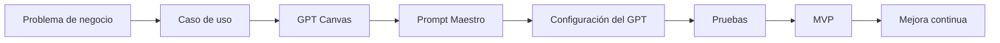

# Capítulo 3. Del GPT Canvas al Prompt Maestro

> **Objetivo del capítulo**
>
> Al finalizar este capítulo comprenderás cómo convertir un GPT Canvas en un Prompt Maestro y por qué este paso es fundamental para construir GPTs empresariales confiables.

---

## 1. ¿Hasta dónde hemos llegado?

En los capítulos anteriores:

- identificamos un problema de negocio;
- definimos el caso de uso;
- construimos el GPT Canvas;
- establecimos usuarios, entradas, actividades, salidas y restricciones.

Ahora debemos responder una pregunta fundamental:

> **¿Cómo logramos que ChatGPT se comporte exactamente como imaginamos?**

La respuesta es mediante el **Prompt Maestro**.

El GPT Canvas nos ayuda a diseñar la solución. El Prompt Maestro convierte ese diseño en instrucciones claras, reutilizables y verificables para el GPT.

---

## 2. Del diseño a la construcción

Imagina que deseas construir una casa.

Primero elaboras los planos. Los planos indican:

- la distribución de los ambientes;
- la ubicación de puertas y ventanas;
- los materiales principales;
- las instalaciones necesarias;
- las restricciones del terreno.

Sin embargo, los planos por sí solos no construyen la casa. También se necesitan instrucciones detalladas para quienes ejecutarán el trabajo.

Con un GPT sucede algo similar:

- el **GPT Canvas** representa el plano;
- el **Prompt Maestro** representa las instrucciones de construcción;
- la **configuración del GPT** representa el ensamblaje de la solución;
- las **pruebas** verifican que el resultado funcione como fue diseñado.

> 💡 **Consejo ILC**
>
> Nunca empieces escribiendo un Prompt Maestro. Primero diseña el GPT.

---

## 3. GPT Canvas vs. Prompt Maestro

| GPT Canvas | Prompt Maestro |
|---|---|
| Diseña el GPT | Define cómo debe comportarse |
| Describe la idea | Describe las instrucciones |
| Lo utiliza el diseñador | Lo interpreta el modelo |
| Responde qué hará | Responde cómo lo hará |
| Organiza el caso de uso | Organiza la ejecución |
| Se valida con negocio | Se valida con pruebas |
| Cambia cuando cambia el diseño | Evoluciona con la mejora continua |

El Canvas y el Prompt Maestro no compiten entre sí. Se complementan.

El Canvas evita que el equipo empiece por la tecnología. El Prompt Maestro evita que el GPT improvise su comportamiento.

---

## 4. ¿Qué es un Prompt Maestro?

Un Prompt Maestro es un conjunto estructurado de instrucciones que define cómo debe actuar un GPT frente a diferentes situaciones.

No es una sola pregunta ni una frase breve. Es un documento operativo que puede incluir:

- rol;
- objetivo;
- contexto;
- usuarios;
- entradas;
- proceso de trabajo;
- formato de salida;
- restricciones;
- validaciones;
- manejo de incertidumbre;
- criterios de calidad.

En un entorno empresarial, el Prompt Maestro cumple una función similar a la de un procedimiento operativo.

Ayuda a que el GPT:

1. entienda su responsabilidad;
2. siga un flujo de trabajo;
3. use un lenguaje adecuado;
4. evite asumir información;
5. entregue resultados consistentes;
6. solicite aclaraciones cuando sea necesario;
7. respete restricciones y políticas.

---

## 5. ¿Por qué no basta con un prompt corto?

Observa este ejemplo:

```text
Ayúdame a elaborar requerimientos funcionales.
```

Este prompt puede producir una respuesta útil, pero deja demasiadas decisiones abiertas.

El GPT tendría que inferir:

- qué tipo de requerimiento se necesita;
- quién será el lector;
- qué metodología debe seguir;
- qué información debe solicitar;
- qué estructura debe utilizar;
- qué hacer si faltan datos;
- qué contenido está prohibido inventar.

Cuando una instrucción deja demasiados espacios vacíos, el modelo completa esos espacios mediante inferencias. Algunas pueden ser correctas y otras no.

En cambio, un prompt estructurado reduce la ambigüedad:

```text
Eres un Analista Funcional Senior especializado en traducir necesidades de negocio en requerimientos claros para equipos de tecnología.

Antes de elaborar cualquier requerimiento, debes validar que la información esté completa.

Si detectas información faltante, realiza preguntas breves y priorizadas al usuario.

No asumas datos que no hayan sido proporcionados o confirmados.

Cuando la información sea suficiente, genera el requerimiento utilizando la plantilla oficial definida para este GPT.
```

La diferencia no está únicamente en la extensión. Está en la claridad del comportamiento esperado.

---

## 6. De una respuesta útil a un comportamiento confiable

Un prompt ocasional busca obtener una buena respuesta.

Un Prompt Maestro busca construir un comportamiento repetible.

| Prompt ocasional | Prompt Maestro |
|---|---|
| Resuelve una consulta puntual | Define una forma de trabajar |
| Puede variar mucho entre conversaciones | Busca consistencia |
| Depende de cómo pregunta el usuario | Orienta al usuario durante el proceso |
| Suele omitir validaciones | Incluye controles y criterios |
| Puede asumir datos | Define cómo manejar vacíos |
| No siempre tiene formato fijo | Establece una estructura de salida |

> ⚠️ **Error común**
>
> Confundir una respuesta correcta con un GPT bien diseñado. Un GPT empresarial debe responder correctamente de forma consistente, no solo una vez.

---

## 7. Caso guía ILC-16

Durante este manual trabajaremos con el caso:

**ILC-16 – GPT Estructurador de Requerimientos Negocio–Tecnología**

### Situación actual

Los equipos de Tecnología reciben solicitudes incompletas, por ejemplo:

> “Necesitamos mejorar el módulo de clientes.”

Esta solicitud genera muchas preguntas:

- ¿Qué problema existe actualmente?
- ¿Qué parte del módulo debe modificarse?
- ¿Quiénes son los usuarios afectados?
- ¿Cuál es el resultado esperado?
- ¿Qué información ingresa y qué información debe producirse?
- ¿Existen reglas de negocio?
- ¿Hay restricciones legales, operativas o de seguridad?
- ¿Cómo se medirá que la mejora fue exitosa?

Un analista humano no debería convertir inmediatamente esa frase en un requerimiento final. Primero tendría que entrevistar al solicitante y completar la información faltante.

Nuestro GPT deberá actuar de la misma manera.

### Comportamiento esperado

El GPT debe:

1. recibir una necesidad expresada en lenguaje de negocio;
2. analizar qué información está disponible;
3. detectar vacíos o contradicciones;
4. formular preguntas de aclaración;
5. confirmar el entendimiento con el usuario;
6. estructurar el requerimiento;
7. revisar la calidad del resultado;
8. entregar un documento claro para Negocio y Tecnología.

Este comportamiento no se obtiene únicamente escribiendo “crea un requerimiento”. Debe diseñarse y documentarse.

---

## 8. Cómo se transforma el Canvas en instrucciones

Cada bloque del GPT Canvas se convierte en una parte del Prompt Maestro.

| Bloque del GPT Canvas | Transformación en el Prompt Maestro |
|---|---|
| Problema | Explica por qué existe el GPT |
| Objetivo | Define la misión principal |
| Usuario | Determina tono, lenguaje y nivel técnico |
| Entradas | Define qué información debe recibir o solicitar |
| Actividades | Se convierte en el proceso paso a paso |
| Salidas | Define la estructura del entregable |
| Restricciones | Se convierte en reglas y prohibiciones |
| Criterios de éxito | Se convierte en validaciones de calidad |

Por ejemplo:

### Canvas

```text
Entrada: solicitud inicial del usuario de negocio.
```

### Prompt Maestro

```text
Recibe la solicitud inicial del usuario y analiza si contiene, como mínimo, problema, objetivo, usuarios afectados, alcance y resultado esperado.

Si alguno de estos elementos falta, no generes todavía el requerimiento final. Formula preguntas de aclaración.
```

El Canvas expresa el diseño. El Prompt Maestro lo convierte en conducta.

---

## 9. Flujo oficial de la metodología ILC



Este orden es importante.

Si comenzamos directamente por el prompt, podemos construir una solución técnicamente interesante pero desconectada del problema real.

Si omitimos las pruebas, podemos tener un GPT que funciona bien en ejemplos simples pero falla ante situaciones reales.

Si omitimos la mejora continua, el GPT quedará congelado aunque cambien el proceso, las políticas o las necesidades del negocio.

> 🏛️ **Arquitecto ILC**
>
> El valor no está en escribir instrucciones largas. Está en traducir correctamente una necesidad de negocio en un comportamiento observable, verificable y mejorable.

---

## 10. Primera pausa de reflexión

Antes de avanzar, responde estas preguntas para el caso que trabajas en tu equipo:

1. ¿Cuál es el problema de negocio que justifica el GPT?
2. ¿Qué decisiones no debería tomar el GPT por sí solo?
3. ¿Qué información deberá pedir antes de generar una respuesta final?
4. ¿Qué salida deberá entregar?
5. ¿Cómo sabremos que su respuesta tiene calidad?

No escribas todavía el Prompt Maestro completo. Primero confirma que el diseño sea suficientemente claro.

---

## Avance del capítulo

Este archivo se enriquecerá en los siguientes bloques con:

- errores frecuentes al pasar del Canvas al Prompt Maestro;
- patrones y anti-patrones;
- arquitectura del Prompt Maestro;
- laboratorio aplicado al caso ILC-16;
- checklist de preparación para el capítulo 4.
